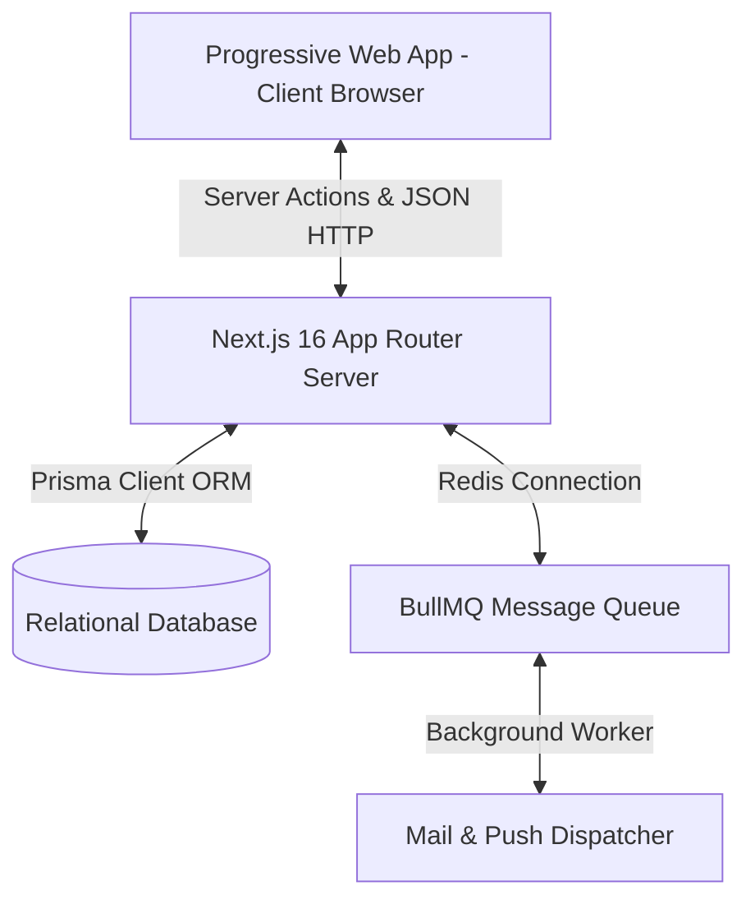

# Schoolyard Tech Stack & Architecture Deep Dive

This document details the high-level infrastructure, software architecture, relational database modeling, and codebase organization that makes Schoolyard extremely robust, fast, and scalable.

---

## 🛠️ The Technology Ecosystem

Schoolyard is engineered around a modern, unified JavaScript/TypeScript ecosystem for server and client execution:



* **Runtime Environment**: **Bun** — used for rapid dependency resolutions, lightning-fast test executions via Vitest, and lightweight script runners.
* **Core Framework**: **Next.js 16** — utilizing the **App Router** for layout hierarchies, Server Component render engines, and Server Actions for unified API mutations.
* **Database & ORM**: **Prisma ORM** — supplying robust type safety, automated migrations, and schema modeling for SQLite (local development) and PostgreSQL (production).
* **Styling & Theme**: **Vanilla CSS & TailwindCSS** — providing high-fidelity responsiveness, dynamic dark-mode triggers, and customizable global color profiles.
* **Background Queues**: **BullMQ (Redis)** — handling decoupled, asynchronous workflows such as message broadcast distributions, email sends, and notification push dispatches.
* **Testing Engine**: **Vitest** — running high-performance unit and server action integration tests with custom database mocks.

---

## ⚡ Server-Side Architecture: Server Actions

Schoolyard does not rely on heavy, separate REST APIs. Instead, it utilizes **Next.js Server Actions** to bridge the client and server.

### Core Implementation Principles

1. **Direct Imports**: Client components import Server Actions directly, which compile down to secure HTTP POST endpoints automatically handled by Next.js.
2. **Strict Server Executions**: Actions are declared with the `"use server"` directive at the top of their files. They run securely in a Node/Bun environment on the server side, allowing direct access to the database via Prisma without exposing credentials.
3. **Zod Validation**: Every mutating server action uses `zod` to securely parse and validate form data/JSON schemas *on the server* before hitting the database, preventing injection or malformed data.
4. **Next.js Cache Revalidation**: Mutations invoke `revalidatePath` or `revalidateTag` to trigger immediate on-demand cache purges. For example, updating a gradebook score instantly triggers an LMS route update, keeping the UI completely in sync without full page refreshes.

---

## 🗄️ Relational Database Schema Model

Schoolyard implements a clean, relational database design optimized to avoid table bloat and preserve relational integrity. Below is an overview of the core model linkages in `prisma/schema.prisma`:

### Core User & Profile Models
* **`User`**: The canonical account record (name, email, hashed password, role: `ADMIN`, `TEACHER`, `STUDENT`, `PARENT`).
* **`Student`**: Holds grade levels, medical accommodation text, and points to `User`. Linkages include `enrollments` (sections), `parents` (parent relationships), `attendance` (days), and `incidents` (disciplinary logs).
* **`Parent`**: Holds phone numbers, points to `User`, and links to multiple `Student` profiles through the join table `StudentParent`.

### LMS & Academic Models
* **`Course`**: High-level courses (e.g., "Algebra I") with configurations (subject, weight, archiving status `isArchived`).
* **`Section`**: A scheduled class instance of a `Course` (e.g., "Algebra I - Block A"), linked to a `Term`, a grading `Teacher`, and a set of `Student` enrollments.
* **`Enrollment`**: Join table connecting `Student` to `Section` with active status states (`ENROLLED`, `WITHDRAWN`).
* **`Assignment`**: Individual assignments defined by teachers inside a `Section`, classified into weighted categories (HOMEWORK, QUIZ, TEST).
* **`Grade`**: Individual score records for a `Student` on an `Assignment`.
* **`Term`**: Defines academic calendar limits (start date, end date, active state) and handles off-days.
* **`ReportCard`**: The published academic term summary including grade averages, teacher remarks, and GPA.

### SMS & Incident Models
* **`Attendance`**: Daily check-in records containing `studentId`, `date`, and a status status (`PRESENT`, `ABSENT`, `TARDY`).
* **`Incident`**: Disciplinary behavioral reports containing `studentId`, severity levels (`LOW`, `MEDIUM`, `HIGH`), status lifecycles (`OPEN`, `INVESTIGATING`, `CLOSED`), and administrator notes.
* **`CommunitySession`**: Activity slots for community or extracurricular activities containing room assignments, occupancy limits, and student enrollments.

---

## 📦 Decoupled Background Processing (BullMQ)

For high-volume operations like sending a mass email broadcast to 500 parents or dispatching mobile push notifications, Schoolyard delegates execution to a **BullMQ** queue backed by **Redis**.

```
[Server Action: sendBroadcast]
           │
           ▼
┌─────────────────────────┐
│  Queue: "broadcasts"   │
└─────────────────────────┘
           │ (Pushed via Redis)
           ▼
┌─────────────────────────┐
│ Worker: broadcastWorker │
└─────────────────────────┘
           │ (Batch processes)
           ├─────────────────────────┐
           ▼                         ▼
┌─────────────────────┐    ┌─────────────────────┐
│    Resend Email     │    │   Web Push Client   │
│   (batch send)      │    │   (push trigger)    │
└─────────────────────┘    └─────────────────────┘
```

1. **Broadcast Creation**: The Server Action creates a single `Broadcast` database record and pushes a job to the Redis queue.
2. **輕量級 recipient dispatches**: The background worker picks up the job and splits the audience into lightweight `BroadcastDelivery` tracking records (one per channel/recipient).
3. **Resend Batching**: Instead of making 500 synchronous requests, the worker compiles these entries and invokes `resend.batch.send()`, transferring execution in a single rapid batch HTTP call.
4. **Fail-Safe Retries**: If an email or push notification fails, the worker logs the issue into the `BroadcastDelivery` entry and schedules an automated retry backoff queue task, avoiding blocking the main application server.

---

## 📂 Codebase Directory Map

The Schoolyard workspace structure is modular and highly intuitive:

```
├── .github/                # GitHub workflows (CI setup, Node & Bun execution)
├── docs/                   # Internal architecture proposals and redesign plans
├── prisma/                 # Database configuration, schema.prisma, and seed scripts
├── public/                 # PWA icons, static assets, and generated service workers
├── wiki/                   # GitHub Wiki pages (This documentation suite)
├── worker/                 # Custom service worker code (TypeScript PWA logic)
└── src/
    ├── app/                # Next.js App Router root
    │   ├── actions/        # Server Actions (auth, academics, discipline, messaging)
    │   ├── api/            # API Route handlers (Auth handlers, uploads, webhook receivers)
    │   └── dashboard/      # Main application dashboard layout and pages
    ├── components/         # Reusable presentation and layout elements
    │   ├── dashboard/      # Feature components (Bell schedules, gradebooks, messaging)
    │   ├── layout/         # Shell sidebars, navigation bars, and theme controllers
    │   ├── providers/      # React context wrappers (Authentication, themes)
    │   └── ui/             # Shadcn-inspired basic components (Buttons, inputs, dialogs)
    ├── hooks/              # Custom client hooks (Push notifications, service worker installers)
    ├── lib/                # Shared utilities (Authentication, date formatters, database clients)
    └── test/               # Centralized test setups and mocks (Vitest setup engines)
```
